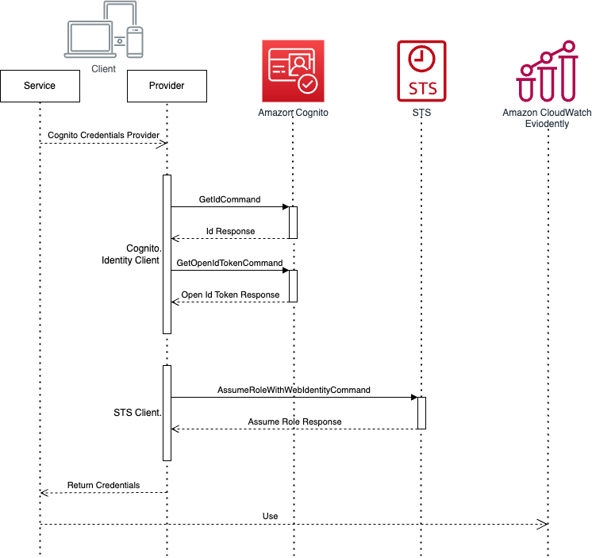

# Cognito unauthenticated identity provider

Amazon Cognito identity pools support both authenticated and unauthenticated identities. Authenticated identities belong to users who are authenticated by any supported identity provider. Unauthenticated identities typically belong to guest users.



## Amazon Cognito
To create an identity pool using the Amazon Cognito console
1. Go to the `Amazon Cognito` console.
1. Choose `Manage Identity Pools`.
1. Choose `Create new identity pool`, then enter a name for your identity pool.
1. From the Unauthenticated identities collapsible section, choose `Enable access to unauthenticated identities`.
1. Choose `Create Pool`.

## Set up permission
### Trust policy
The trust policy determines who can assume this role. The trust relationship policy allows the use of sts:AssumeRoleWithWebIdentity and sts:TagSession to allow access. It adds conditions to restrict the policy to the identity pool that you created and it makes sure that it’s for an authenticated role.
```
{
  "Version": "2012-10-17",
  "Statement": [
    {
      "Sid": "",
      "Effect": "Allow",
      "Principal": {
        "Federated": "cognito-identity.amazonaws.com"
      },
      "Action": "sts:AssumeRoleWithWebIdentity",
      "Condition": {
        "StringEquals": {
          "cognito-identity.amazonaws.com:aud": "IDENTITY-POOL-ID"
        },
        "ForAnyValue:StringLike": {
          "cognito-identity.amazonaws.com:amr": "unauthenticated"
        }
      }
    }
  ]
}
```

### Permissions policy
For example, the following permissions policy does two things:
* Allows list access to all S3 buckets that end with a prefix that matches the user’s department name.
* Allows read access on files in these buckets as long as the clearance tag on the file matches user’s clearance attribute.
```
{
    "Version": "2012-10-17",
    "Statement": [
        {
            "Effect": "Allow",
            "Action": "s3:List*",
            "Resource": "arn:aws:s3:::*-${aws:PrincipalTag/department}"
        },
        {
            "Effect": "Allow",
            "Action": "s3:GetObject*",
            "Resource": "arn:aws:s3:::*-${aws:PrincipalTag/department}/*",
            "Condition": {
                "StringEquals": {
                    "s3:ExistingObjectTag/clearance": "${aws:PrincipalTag/clearance}"
                }
            }
        }
    ]
}
```

## References
* [Allowing unauthenticated guest access to your application using Amazon Cognito](https://docs.aws.amazon.com/location/latest/developerguide/authenticating-using-cognito.html)
* [Role trust and permissions](https://docs.aws.amazon.com/cognito/latest/developerguide/role-trust-and-permissions.html)
* [Amazon Cognito Identity Provider examples using SDK for JavaScript (v3)](https://docs.aws.amazon.com/sdk-for-javascript/v3/developer-guide/javascript_cognito-identity-provider_code_examples.html)
